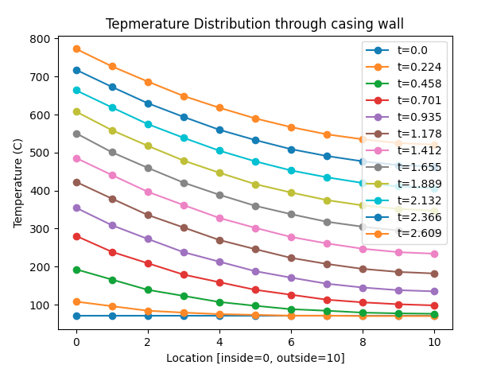

# Casing wall temperature calculation



## Prerequisites

- THERMCAS 
 - Program to calculate cassing wall temperature that runs on MS-DOS by R. Nakka
 - Download link: https://www.nakka-rocketry.net/softw.html

- vDOS 
 - DOS emulator
 - Download link: https://vdos.info/download.html

## Plotting script
```
$ python vis.py
```
